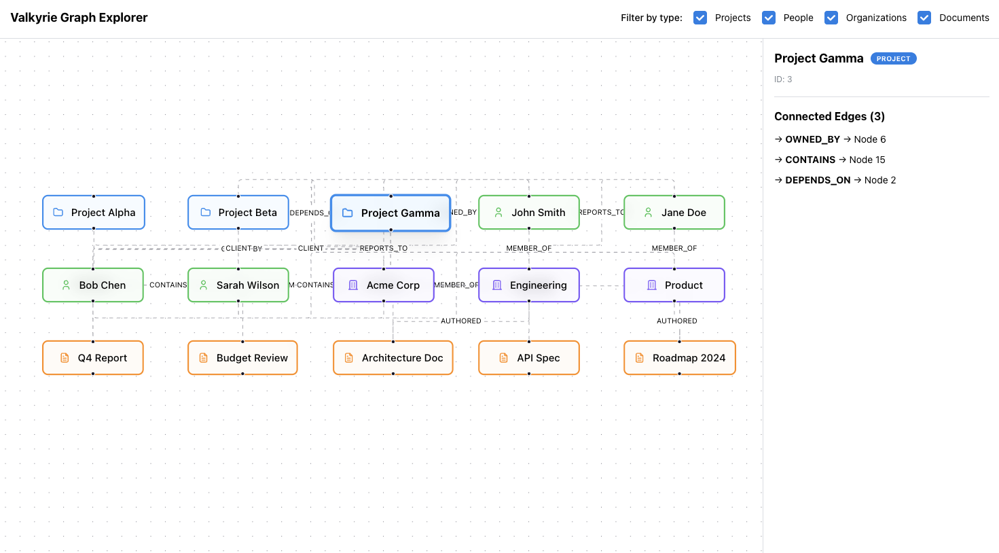

---

# Valkyrie Frontend Engineer Assessment

This project implements a minimal, single-page React application that renders a 2D knowledge graph from static JSON. It uses **Mantine** for layout and UI primitives and **React Flow (XYFlow)** for graph visualization.

## Screenshot



---

## Features

### Graph Visualization

* Renders nodes and edges as a 2D knowledge graph using React Flow.
* Edge labels (e.g., OWNED_BY, CLIENT, REPORTS_TO).

### Node Interaction

* Click any node to select it.
* A side panel displays:

  * Node label
  * Node type
  * Connected edges
  * Relationship directions

### Visual Distinction

* Each node type (Project, Person, Org, Document) has:

  * A consistent theme color
  * A type-appropriate icon

* Selected nodes display:

  * A larger node
  * A larger box shadow

### Bonus Features

* **Keyboard navigation** via Mantine `useHotkeys`

  * Arrow keys move selection through the node topology.
* **Filtering** by node type

  * Filter UI lets you show/hide Projects, People, Orgs, and Documents.
  * Edges automatically filter out when connected nodes are hidden.

### Testing

* Includes one interaction test verifying that node selection updates the detail panel.

---

## Tech Stack

* **React 18**
* **TypeScript**
* **Mantine**
* **React Flow (XYFlow)** for graph rendering
* **Vite** for bundling
* **Vitest + React Testing Library** for minimal testing

---

## Running the Project

### Install dependencies

```bash
npm install
```

### Start the dev server

```bash
npm run dev
```

The app runs on:

```
http://localhost:5173
```

---

## How to Navigate the Graph

### Mouse

* **Click** any node to select it and view details.
* **Pan** by dragging on the background.
* **Zoom** using mouse wheel or trackpad.

### Keyboard

* **Arrow keys** select the node to either the left, right, top or bottom of the current node.

### Filtering (bonus feature)

* Use the filtering control in the header to show/hide node types.

---

## What “Done” Means (Against Acceptance Criteria)

✓ Graph loads from static JSON
✓ Nodes render with type-based visual distinction
✓ Clicking a node reveals details
✓ Graph remains visible and usable while details panel is open
✓ Edge labels and arrows show relationship types
✓ Basic keyboard navigation implemented
✓ Filtering by node type implemented (bonus)
✓ Includes one meaningful interaction test
✓ README describes setup, usage, assumptions, next steps

---

## Known Limitations

These are intentional due to the 3-hour constraint:

* Graph layout uses React Flow defaults; no custom positioning or layout engine.
* Node details are intentionally minimal—no deep relational view.
* Filtering UI is simple and does not persist any state across refresh.
* No animations, transitions, routing, or API integration.
* No accessibility audit beyond library defaults.

---

## Assumptions

* Static `sample-graph.json` is the only data source.
* No dark mode or theme switching was required.
* A lightweight detail panel is sufficient.
* Graph structure does not require bidirectional edge awareness.
* A single test meets the assessment requirement.

---

## If I Had One More Hour

1. **Cluster nodes by type with vertical layout**
2. **Dim non-neighbors when a node is selected**
3. **Edge interactions** (hovering an edge highlights connected nodes).
4. **Persistent UI state** 

---
